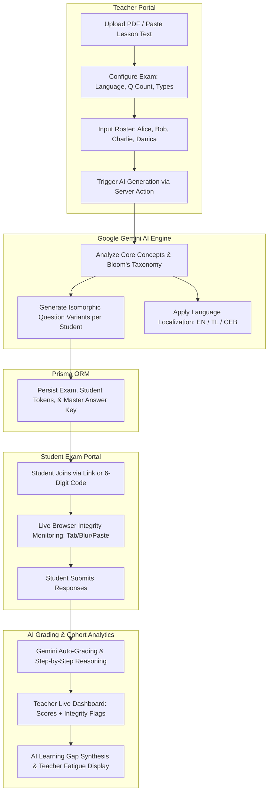

# AI-Powered Personalized Exam & Integrity Analytics Platform
## System Design Specification

* **Date:** 2026-09-03
* **Target:** Hackathon MVP Prototype (8-Minute Live Pitch Optimized)
* **Tech Stack:** Next.js 16 (App Router, Server Actions, Tailwind CSS, Lucide Icons, Shadcn UI patterns), Prisma 8 / 7 with SQLite/PostgreSQL, Google Gemini 3.6 Flash AI SDK (`@google/genai` or `@google/generative-ai`), Client-side Integrity Event Listeners.

---

## 1. Executive Summary & Value Proposition

### 1.1 Core Mission
The platform revolutionizes academic assessment by transforming standard lesson materials (PDFs/notes) into unique, isomorphic exams for every student in a class. It eliminates cheating by design, auto-grades open-ended and objective responses with pedagogical reasoning, monitors active browser integrity, and synthesizes class-wide learning gaps for teachers.

### 1.2 Pitch Differentiators ("Wow Factors")
1. **True Isomorphic Personalization:** Rather than simply shuffling questions, Gemini generates mathematically/conceptually isomorphic variations of questions tailored per student with equal difficulty.
2. **Teacher Fatigue Metric:** Quantifies real value to educators (*"4.5 hours of manual authoring & grading eliminated in 18 seconds"*).
3. **Multi-Language Adaptability:** Real-time generation toggle for English, Tagalog, and Bisaya exams.
4. **Lightweight Integrity Guard:** Plain-JS event tracking (`visibilitychange`, `window.blur`, paste prevention) streamed directly to the live teacher dashboard.
5. **Pitch Presentation Switcher:** Built-in floating demo toolbar enabling 1-click jumps between Teacher View, Student A (Alice - English), Student B (Bob - Tagalog/Bisaya), and a "⚡ Simulate All Submissions" action for instant live analytics.

---

## 2. Architecture & Data Flow



---

## 3. Database Schema (Prisma ORM)

```prisma
datasource db {
  provider = "sqlite"
  url      = env("DATABASE_URL")
}

generator client {
  provider = "prisma-client-js"
}

model Exam {
  id                     String         @id @default(cuid())
  title                  String
  subject                String
  lessonContent          String         // Raw notes or extracted PDF text
  language               String         @default("English") // "English" | "Tagalog" | "Bisaya"
  accessCode             String         @unique // 6-digit code e.g. "849201"
  durationMinutes        Int            @default(30)
  totalQuestions         Int            @default(5)
  timeSavedHoursEstimate Float          @default(4.0)
  createdAt              DateTime       @default(now())
  
  studentExams           StudentExam[]
  analytics              ExamAnalytics?
}

model StudentExam {
  id               String            @id @default(cuid())
  examId           String
  studentName      String
  accessToken      String            @unique @default(cuid())
  status           String            @default("PENDING") // PENDING | IN_PROGRESS | SUBMITTED | FLAGGED
  totalScore       Float?
  maxPossibleScore Float             @default(100)
  startedAt        DateTime?
  submittedAt      DateTime?
  
  exam             Exam              @relation(fields: [examId], references: [id], onDelete: Cascade)
  questions        QuestionVariant[]
  integrityLogs    IntegrityLog[]
}

model QuestionVariant {
  id              String       @id @default(cuid())
  studentExamId   String
  questionIndex   Int          // 1, 2, 3...
  type            String       // "MCQ" | "SHORT_ANSWER"
  prompt          String
  options         String?      // JSON string array for MCQ choices: ["A...", "B...", "C...", "D..."]
  correctAnswer   String       // Master answer / rubric standard
  studentAnswer   String?
  isCorrect       Boolean?
  pointsAwarded   Float?
  maxPoints       Float        @default(10)
  aiExplanation   String?      // Step-by-step grading explanation
  
  studentExam     StudentExam  @relation(fields: [studentExamId], references: [id], onDelete: Cascade)
}

model IntegrityLog {
  id            String       @id @default(cuid())
  studentExamId String
  eventType     String       // "TAB_SWITCH" | "WINDOW_BLUR" | "PASTE_ATTEMPT" | "FULLSCREEN_EXIT"
  timestamp     DateTime     @default(now())
  details       String?
  
  studentExam   StudentExam  @relation(fields: [studentExamId], references: [id], onDelete: Cascade)
}

model ExamAnalytics {
  id                     String   @id @default(cuid())
  examId                 String   @unique
  classAverage           Float
  topMissedConcepts      String   // JSON array of strings
  aiSynthesisSummary     String   // AI cohort performance & learning gap analysis
  aiRecommendations      String   // Actionable recommendations for next lesson
  updatedAt              DateTime @updatedAt
  
  exam                   Exam     @relation(fields: [examId], references: [id], onDelete: Cascade)
}
```

---

## 4. AI Engine & Prompt Engineering Contracts

### 4.1 Isomorphic Generation Contract
```typescript
interface GenerateIsomorphicExamsInput {
  lessonContent: string;
  subject: string;
  language: "English" | "Tagalog" | "Bisaya";
  questionCount: number;
  roster: string[]; // ['Alice', 'Bob', 'Charlie', 'Danica']
}

interface IsomorphicQuestionOutput {
  questionIndex: number;
  type: "MCQ" | "SHORT_ANSWER";
  conceptTested: string;
  difficulty: "EASY" | "MEDIUM" | "HARD";
  prompt: string;
  options?: string[]; // 4 distinct options for MCQs
  correctAnswer: string;
  gradingRubric: string;
}

interface StudentExamOutput {
  studentName: string;
  questions: IsomorphicQuestionOutput[];
}
```

### 4.2 Auto-Grading & Reasoning Evaluation Contract
```typescript
interface GradeStudentAnswerInput {
  prompt: string;
  type: "MCQ" | "SHORT_ANSWER";
  studentAnswer: string;
  correctAnswer: string;
  gradingRubric: string;
  maxPoints: number;
}

interface GradeStudentAnswerOutput {
  isCorrect: boolean;
  pointsAwarded: number;
  aiExplanation: string; // Pedagogical feedback explaining why the answer was correct or where the misconception lies
}
```

### 4.3 Class Learning Gap Synthesis Contract
```typescript
interface ClassAnalyticsInput {
  examTitle: string;
  results: Array<{
    studentName: string;
    totalScore: number;
    missedQuestions: Array<{
      concept: string;
      studentAnswer: string;
      correctAnswer: string;
      aiExplanation: string;
    }>;
  }>;
}

interface ClassAnalyticsOutput {
  classAverage: number;
  topMissedConcepts: string[];
  aiSynthesisSummary: string;
  aiRecommendations: string;
}
```

---

## 5. UI / UX Components & Views

### 5.1 Route Hierarchy
```
/                           -> Landing page & Quick-Launch Pitch Portal
/teacher                    -> Teacher Dashboard (Active exams & quick create)
/teacher/create             -> Wizard (Upload/Preset -> Config -> Roster -> Generate)
/teacher/exam/[id]          -> Live Monitor & Real-Time Integrity / Cohort Analytics
/join                       -> Student 6-Digit Code Entry
/exam/[token]               -> Active Student Exam Room (with integrity listeners)
/exam/[token]/result        -> Instant AI Student Feedback Report
```

### 5.2 Key UI Components
* **`DemoSwitcherToolbar`**: Sticky floating bar at top for judges. Contains quick links to `/teacher/exam/[id]`, `/exam/[aliceToken]`, `/exam/[bobToken]`, and `⚡ Simulate Class Completion`.
* **`TeacherFatigueBanner`**: Prominent metric card calculating time saved based on formula:
  $$\text{Hours Saved} = \frac{\text{Questions} \times \text{Students} \times 4.5\text{ min}}{60} + 1.5\text{ hrs (authoring)}$$
* **`IntegrityMonitorGuard`**: Zero-dependency client component attaching `visibilitychange`, `window.onblur`, and `contextmenu` events that automatically log violations to the server.
* **`CohortMasteryHeatmap`**: Visual progress bars and badges illustrating student concept comprehension.
* **`PresetLessonSelector`**: Quick-load buttons for:
  1. *Biology*: "Cellular Respiration & Photosynthesis"
  2. *Philippine History*: "The Philippine Revolution & Katipunan"
  3. *Computer Science*: "Data Structures & Big-O Complexity"

---

## 6. Resilience, Fallback & Stage-Safe Architecture

1. **Stage-Safe Fallback Generator**:
   * If `GEMINI_API_KEY` is not provided or fails due to network outage, the backend transparently serves pre-calculated realistic isomorphic exam variants for the sample presets.
   * Ensures the live pitch never hangs or displays a 500 error on stage.
2. **Local Draft Persistence**:
   * Student answers are synced to `localStorage` continuously to prevent lost progress on reload.
3. **Debounced Integrity Logging**:
   * Violation events are batched and debounced to prevent network thrashing on rapid alt-tabbing.

---

## 7. Spec Self-Review Checklist

- [x] **Placeholder scan:** No "TBD", "TODO", or missing details; all data models, routes, and prompt interfaces are concrete.
- [x] **Internal consistency:** Schema models align directly with UI routes and Gemini contracts.
- [x] **Scope check:** Appropriately constrained to Phase 2 (Generation), Phase 3 (Access/Exam), Phase 4 (Integrity), and Phase 5 (Grading & Analytics) for a high-impact hackathon presentation.
- [x] **Ambiguity check:** Explicitly detailed language options, integrity events, and isomorphic question mechanics.
